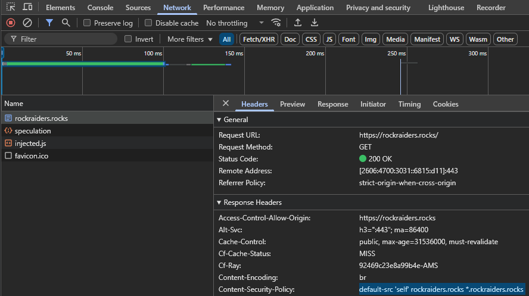
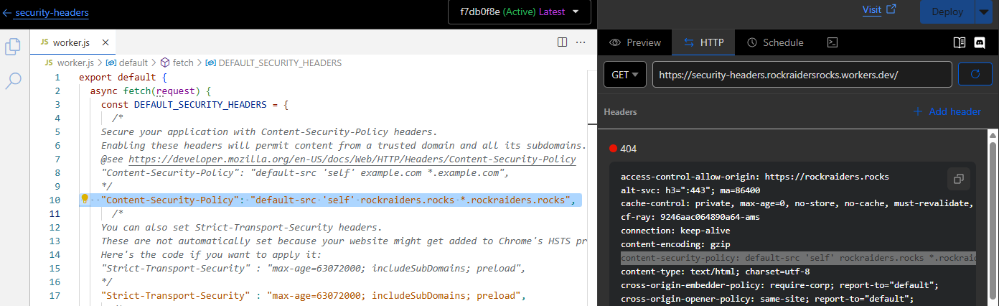

# rockraiders.rocks & lrr.researchrealm.net
Git repo for the website rockraiders.rocks and lrr.researchrealm.net

## Security Headers and you

This website is hosted fully on [CloudFlare JAM](https://www.cloudflare.com/learning/performance/what-is-jamstack/), so we don't have access to a webserver so configuring security headers is done using a [CloudFlare Worker](https://developers.cloudflare.com/workers/). Basically we have a little bit of JavaScript running on each route that sets the [HTTP Headers](https://developer.mozilla.org/en-US/docs/Web/HTTP/Reference/Headers). We try to configure these as tightly as possible and verify it using [securityheaders.com](https://securityheaders.com/?q=https%3A%2F%2Frockraiders.rocks%2F&followRedirects=on), at the time of writing this has the hightest score (A+).

### Where can i verify the Security Headers withoud visiting the main webpage itself?

You can visit: https://security-headers.rockraidersrocks.workers.dev/ and verify it's HTTP headers by opening your [developer console](https://balsamiq.com/support/faqs/browser-console/) in your favorite internet browser. Then visit the Network tab and refresh the page to open the rockraiders.rocks object (index.html) and view it's Response Headers.

### Where can i see what is exactly configured for this worker?

Here: [security-headers-worker JavaScript](security-headers-worker.js)

### Where and how do we configure the routes?

When logging into dash.cloudflare.com, opening the account, choose rockraiders.rocks, Workers Routes or [here](https://dash.cloudflare.com/c7000110a231a8e08fc154244075ebdd/rockraiders.rocks/workers).

### Where is the worker configured?

You can immediatly go to this page by click [here](https://dash.cloudflare.com/c7000110a231a8e08fc154244075ebdd/workers/services/edit/security-headers/production) or from the same location above, you can click on security-headers. But when logging into dash.cloudflare.com, opening the account, go to Workers & Pages, open security-headers. Clicking on the </> icon in the top right opens the window where the worker can be programmed.

